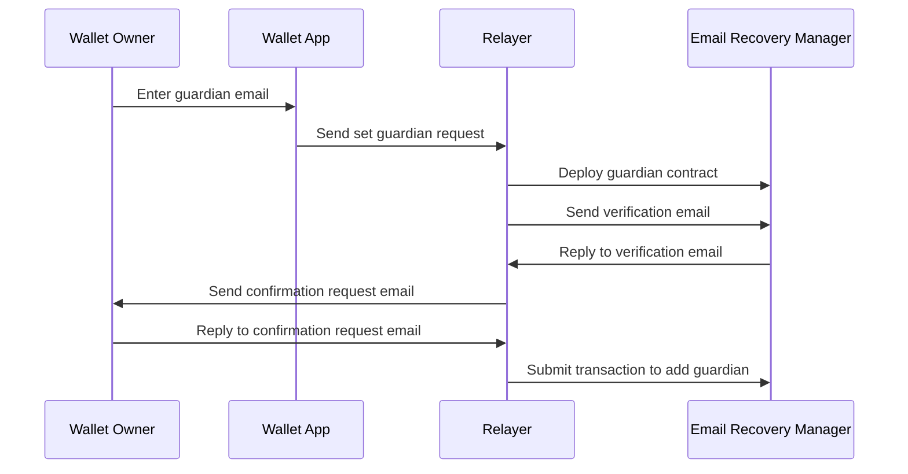
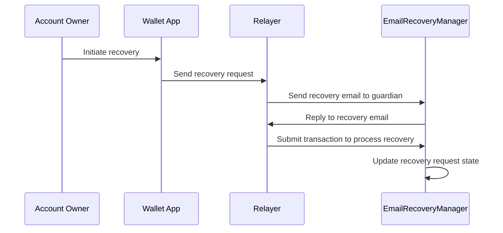
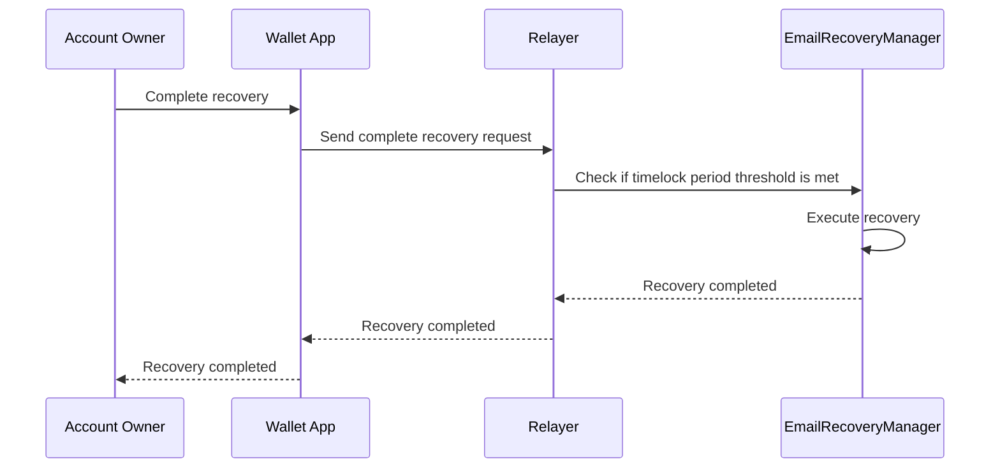

import DocCardList from '@theme/DocCardList';

# Account Recovery

**ZK Email Account Recovery** is a recovery mecanism that allows [ERC-4337 ](https://www.erc4337.io/)and [ERC-7579](https://erc7579.com/) compatible accounts to recover the access by using a trusted email address as a guardian and a zero-knowledge proofs to verify the authenticity of the recovery request.

## How it works?

To enable this mechanism, the user has to set up a [guardian](#what-is-a-guardian). Once completed, the user can use the guardian to recover the account if they lose access to their account.

When the account owner initiates a recovery process, the guardian receives an email requesting their confirmation. By simply replying to this email, the guardian authorizes the recovery, allowing the account owner to regain access to their account.

The completely cycle of the account recovery is:

1. Requesting a guardian.
2. Accepting a guardian.
3. Processing a recovery for each guardian. 
4. Completing a recovery.*

:::note
**To ensure security, the guardian includes a timelock feature.**

 Once this required threshold of the guardian has confirmed the recovery, a timelock delay begins. This delay provides the original account owner with a window of opportunity to notice and cancel the request if the recovery was initiated maliciously.
 
 If no action is taken during the timelock period, the recovery process can be completed, and the account ownership is securely transferred.
:::

## What is a guardian?

A **"guardian"** is a trusted email address designated by the account owner to assist in the recovery process. The user can set up multiple guardians following the [setup process](#setup-process). 

The guardian's email address is kept private on-chain through the use of zero-knowledge proofs, ensuring confidentiality while still enabling secure account recovery.

## Account Recovery Flow

### Setup process

To be able to use the account recovery mechanism, the user has to set up a guardian. 

1. The wallet owner enters the email address of the guardian they want to set up in their wallet app.
2. The wallet app sends a request to the relayer to set up the guardian.
3. The relayer deploys a new guardian contract in the Email Recovery Manager.
4. The relayer sends a verification email to the guardian's email address through the Email Recovery Manager.
5. The guardian replies to the verification email, confirming their email address.
6. The relayer sends a confirmation request email to the wallet owner.
7. The wallet owner replies to the confirmation request email, approving the addition of the guardian.
8. The relayer submits a transaction to the Email Recovery Manager to add the guardian to the account recovery mechanism.

### Recovery process

After the wallet owner has set up a guardian, they can use it to recover the account if they lose access to it.

The first step of the recovery process is to **initiate the recovery process**.

1. The account owner initiates the recovery process through their wallet app.
2. The wallet app sends a recovery request to the relayer.
3. The relayer sends a recovery email to the designated guardian associated with the account.
4. The guardian replies to the recovery email, confirming the recovery request.
5. The relayer submits a transaction to the EmailRecoveryManager to process the recovery.
6. The EmailRecoveryManager updates the state of the recovery request.

After the recovery request is processed, the account owner can **complete the recovery process**.
1. The account owner initiates the completion of the recovery process through their wallet app.
2. The wallet app sends a complete recovery request to the relayer.
3. The relayer checks with the EmailRecoveryManager if the timelock period threshold has been met.
4. If the timelock period threshold is met, the EmailRecoveryManager executes the recovery process.
5. The EmailRecoveryManager notifies the relayer that the recovery is completed.
6. The relayer informs the wallet app that the recovery is completed.
7. The wallet app notifies the account owner that the recovery process is successfully completed.

:::info
The completion step can only be triggered if the timelock period threshold is met.
:::

