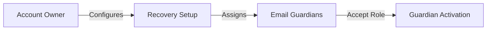
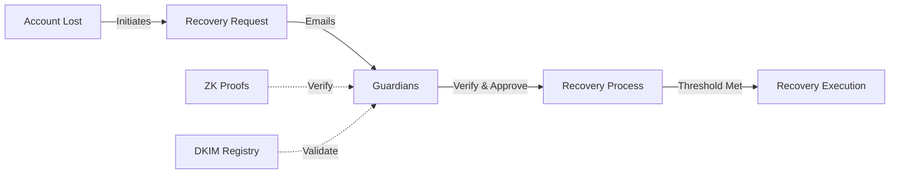

import DocCardList from '@theme/DocCardList';

# Overview

ZK Email Recovery enables secure account recovery in web3 through email verification and zero-knowledge proofs, allowing users to recover accounts via trusted email guardians while maintaining privacy. Unlike traditional email recovery systems, it uses zero-knowledge proofs to verify guardian identities without exposing their information on-chain.

## Core Components

The ZK Email Recovery system consists of four main components that work together to enable secure account recovery:

**EmailRecoveryManager** serves as the core orchestration contract for the recovery process. This component manages guardian relationships and recovery logic, validates all recovery attempts, and is designed to work seamlessly with any account implementation.

**Command Handlers** are responsible for processing email-based recovery commands. They validate command syntax and signatures while supporting multiple languages. The handlers come in three variants - a universal handler that works with any validator, a Safe-specific handler optimized for Safe accounts, and an address-hiding handler for enhanced privacy.

**Recovery Modules** execute the actual recovery operations. These specialized components contain the recovery logic for different account types and include both universal and Safe-specific implementations to handle various recovery scenarios.

**ZK Email System** forms the privacy layer of the recovery system. It enables proving email ownership without revealing addresses, handles email authentication through DKIM verification, and ensures guardian privacy is maintained on-chain.

## Account Recovery Flow

### Setup Process

The setup process establishes your account's recovery safety net. As an account owner, you first configure the recovery parameters like threshold requirements and timelock delays. You then assign trusted email guardians. Each guardian receives an invitation and must actively accept their role by proving email ownership through our ZK email verification system. Only after guardians accept their roles does the recovery system become fully operational.

### Recovery Process

When account access is lost, the recovery process begins with a formal recovery request. This triggers automated emails to your designated guardians. Each guardian's approval involves a two-step verification:
1. Email authenticity is verified through DKIM validation
2. Guardian identity is confirmed via zero-knowledge proofs

The system accumulates guardian approvals until reaching the preset threshold. Throughout this process, all guardian interactions remain private - their email addresses and identities are never exposed on-chain. Once the threshold is met, a timelock period begins before the recovery executes, providing a final security buffer against unauthorized recovery attempts.

## Documentation

<DocCardList 
  items={[
    {
      type: 'link',
      href: '/account-recovery/architecture',
      label: 'Architecture',
      description: 'Deep dive into system components, flows, and integration patterns.',
    }
  ]}
/>