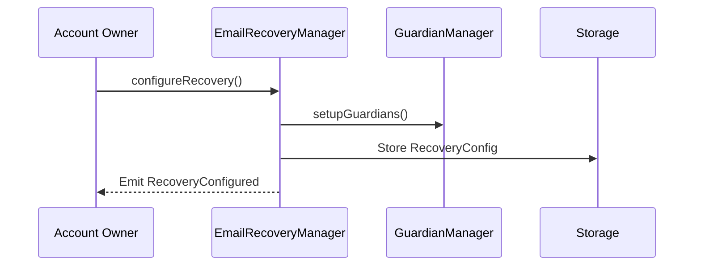
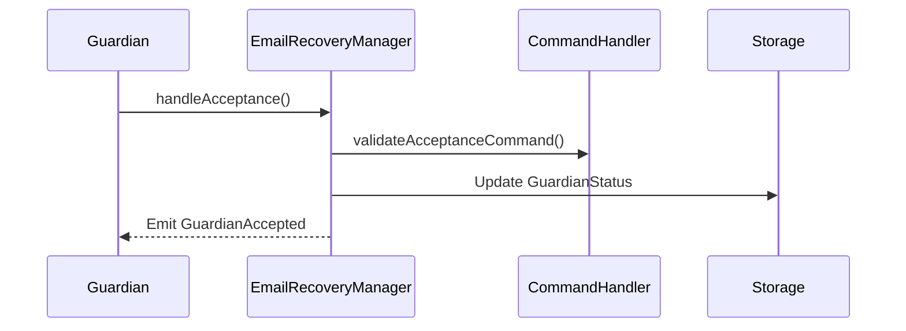
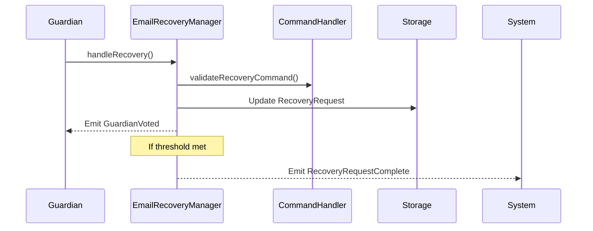
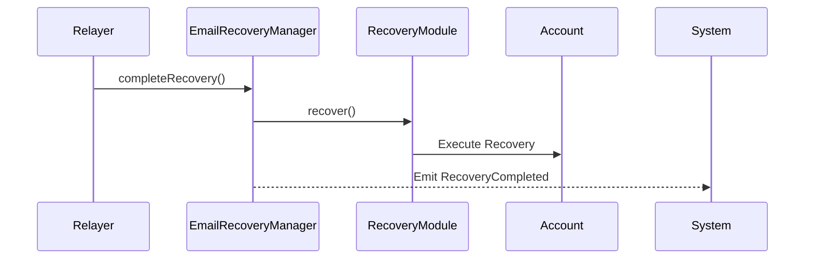

# Architecture

## Core Contracts

### EmailRecoveryManager

The `EmailRecoveryManager` contract is the central orchestrator for email-based account recovery. It inherits from `EmailAccountRecovery` and defines the core recovery logic that can be used across different account implementations.

Key responsibilities:
- Manages guardian configurations and states
- Validates recovery attempts
- Coordinates the recovery flow
- Handles guardian acceptance and voting
- Manages recovery timeouts and delays

Reference implementation:

```30:35:src/EmailRecoveryManager.sol
abstract contract EmailRecoveryManager is
    EmailAccountRecovery,
    GuardianManager,
    Ownable,
    IEmailRecoveryManager
{
```


### Command Handlers

Command handlers define and validate email recovery commands. Three main implementations:

1. **EmailRecoveryCommandHandler** (Universal)
- Generic handler for any validator
- Acceptance command: `Accept guardian request for {ethAddr}`
- Recovery command: `Recover account {ethAddr} using recovery hash {string}`

2. **SafeRecoveryCommandHandler**
- Safe-specific implementation
- Custom commands for Safe account recovery

3. **AccountHidingRecoveryCommandHandler**
- Privacy-focused implementation
- Hashes account addresses in commands
- Acceptance command: `Accept guardian request for {string}`
- Recovery command: `Recover account {string} using recovery hash {string}`

Interface definition:

```4:47:src/interfaces/IEmailRecoveryCommandHandler.sol
interface IEmailRecoveryCommandHandler {
    function acceptanceCommandTemplates() external pure returns (string[][] memory);
    function recoveryCommandTemplates() external pure returns (string[][] memory);

    function extractRecoveredAccountFromAcceptanceCommand(
        bytes[] memory commandParams,
        uint256 templateIdx
    )
        external
        view
        returns (address);

    function extractRecoveredAccountFromRecoveryCommand(
        bytes[] memory commandParams,
        uint256 templateIdx
    )
        external
        view
        returns (address);

    function validateAcceptanceCommand(
        uint256 templateIdx,
        bytes[] memory commandParams
    )
        external
        view
        returns (address);

    function validateRecoveryCommand(
        uint256 templateIdx,
        bytes[] memory commandParams
    )
        external
        view
        returns (address);

    function parseRecoveryDataHash(
        uint256 templateIdx,
        bytes[] memory commandParams
    )
        external
        view
        returns (bytes32);
}
```


### Recovery Modules

#### EmailRecoveryModule
- Implements ERC7579 executor interface
- Handles recovery for modular accounts
- Target validator-specific implementation

Key features:

```21:35:src/modules/EmailRecoveryModule.sol
contract EmailRecoveryModule is EmailRecoveryManager, ERC7579ExecutorBase, IEmailRecoveryModule {
    /*´:°•.°+.*•´.*:˚.°*.˚•´.°:°•.°•.*•´.*:˚.°*.˚•´.°:°•.°+.*•´.*:*/
    /*                    CONSTANTS & STORAGE                     */
    /*.•°:°.´+˚.*°.˚:*.´•*.+°.•°:´*.´•*.•°.•°:°.´:•˚°.*°.˚:*.´+°.•*/

    /**
     * Validator being recovered
     */
    address public immutable validator;

    /**
     * function selector that is called when recovering validator
     */
    bytes4 public immutable selector;

```


#### SafeEmailRecoveryModule
- Safe-specific recovery implementation
- Uses Safe's module system
- Executes owner swaps for recovery

Implementation:

```15:27:src/modules/SafeEmailRecoveryModule.sol
contract SafeEmailRecoveryModule is EmailRecoveryManager {
    /*
     * The function selector for rotating an owner on a Safe
     */
    bytes4 public constant selector = bytes4(keccak256(bytes("swapOwner(address,address,address)")));

    event RecoveryExecuted(address indexed account);

    error ModuleNotInstalled(address account);
    error InvalidAccount(address account);
    error InvalidSelector(bytes4 selector);
    error RecoveryFailed(address account, bytes returnData);
    error ResetFailed(address account);
```


## Account Recovery Flows

### Configuration


### Guardian Acceptance


### Recovery Process


### Recovery Execution

