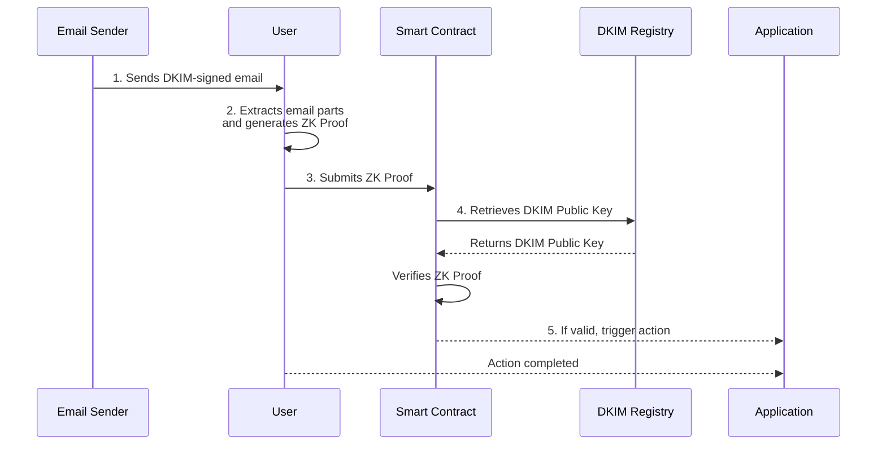

import DocCardList from '@theme/DocCardList';

# How ZK Email Works: Your Inbox as a Cryptographic Vault

Think of DKIM email signatures like a notary's cryptographic seal on documents. When Gmail signs an email with DKIM, it's like a notary using their private key to create an unforgeable digital signature that proves the document's authenticity and integrity.

## The Magic: Selective Disclosure

**Traditional approach**: "Here's my entire bank statement to prove I have $1000"  
**ZK Email approach**: "I can prove I have $1000 without showing my bank statement"

This isn't just privacy—it's **selective truth revelation**. Prove exactly what you need to prove, nothing more.

## Real-World Analogy

When you show ID at a bar, you reveal your address, full name, and ID number just to prove you're over 21. 

**ZK Email is like having an ID that only shows "Yes, over 21" without revealing anything else.**

This same principle applies to emails:
- Prove you attended a conference without showing your personal email
- Verify your job title without revealing your salary details  
- Demonstrate membership without exposing your contact information

## The Four-Step Process

Every ZK Email proof follows this simple pattern:

### 1. 📧 Email Authentication (DKIM)
Every email contains a DKIM signature—an RSA digital signature created by the sending mail server using the domain's private key. This signature cryptographically binds the email content to the claimed sender domain.

*Technical detail: DKIM uses RSA-SHA256 signatures over canonicalized email headers and body, providing authenticity and integrity guarantees under the computational Diffie-Hellman assumption.*

### 2. 🔍 Pattern Matching (Regex Constraints)
Define extraction rules using regular expressions to isolate specific data fields from the authenticated email content. These patterns operate within zero-knowledge circuits to maintain privacy.

*Technical detail: Regex patterns are compiled into finite state automata and implemented as arithmetic circuits, enabling pattern matching with zero-knowledge guarantees.*

### 3. 🛡️ Zero-Knowledge Proof Generation
Generate a succinct cryptographic proof that demonstrates: (1) valid DKIM signature verification, (2) correct regex pattern matching, and (3) accurate data extraction—all without revealing the email contents.

*This leverages SNARKs (Succinct Non-interactive Arguments of Knowledge) to provide computational soundness and zero-knowledge properties.*

### 4. ✅ Universal Verification
Anyone can verify the proof's validity using only the email sender's public DKIM key and the proof data, without accessing the original email or any private information.

*Verification involves checking the SNARK proof against the public DKIM key, providing public verifiability without compromising privacy.*

## Technical Deep Dive

<strong>For developers and researchers who want the technical details</strong>

**Technical Implementation:**
1. **DKIM Signature Verification**: RSA-2048/4096 signature validation implemented in arithmetic circuits using efficient modular exponentiation
2. **Selective Disclosure**: Regex patterns compiled to DFA and implemented as circuit constraints, enabling privacy-preserving data extraction  
3. **Proof Generation**: Groth16/PLONK SNARKs for succinct proofs with ~200ms generation time and ~300 bytes proof size
4. **On-chain Verification**: Smart contracts validate proofs using cached DKIM public keys with O(1) gas complexity

**Security Properties & Assumptions:**
- **Authenticity**: Computational security under RSA assumption and DKIM infrastructure trust
- **Privacy**: Information-theoretic privacy for undisclosed email content; computational privacy for circuit structure
- **Soundness**: Computational soundness under discrete logarithm assumption (SNARK security)
- **Completeness**: Honest provers with valid emails can always generate accepted proofs
- **Trust Model**: Assumes DKIM infrastructure integrity and email provider honest key management

## Explore the Components

<DocCardList 
  items={[
    {
      type: 'link',
      href: '/architecture/dkim-verification',
      label: 'DKIM Verification',
      description: 'How email signatures become cryptographic proofs.',
    },
    {
      type: 'link',
      href: '/architecture/zk-proofs',
      label: 'Zero-Knowledge Proofs',
      description: 'The mathematics behind selective disclosure.',
    },
    {
      type: 'link',
      href: '/architecture/on-chain',
      label: 'Blockchain Integration',
      description: 'How proofs work with smart contracts.',
    },
    {
      type: 'link',
      href: '/architecture/security-considerations',
      label: 'Security & Trust',
      description: 'What you can trust and what you cannot.',
    }
  ]}
/>

## Why This Matters

**For Privacy**: Prove things about yourself without revealing personal information.

**For Security**: Mathematical guarantees replace trust in centralized services.

**For Innovation**: Turn any email interaction into a verifiable credential.

**For Accessibility**: Use familiar email interfaces instead of complex crypto tools.

:::tip Ready to Try It?
The easiest way to understand ZK Email is to [try it yourself](https://prove.email) or follow our [5-minute tutorial](/zk-email-sdk/create-blueprint).
:::

