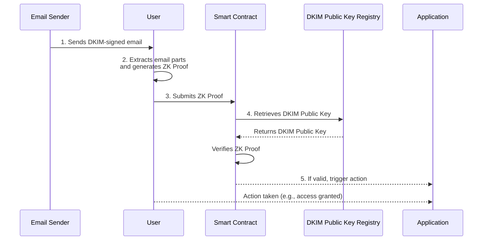

import DocCardList from '@theme/DocCardList';

# Architecture

Learn how ZK Email's architecture combines email verification and zero-knowledge proofs for trustless, private validation of email contents on blockchains, utilizing existing email infrastructure.

---

ZK Email adds new capabilities to existing email infrastructure by using the **DKIM (DomainKeys Identified Mail)** signatures. By integrating **zero-knowledge proofs**, our ZK Email system authenticates DKIM signatures and validates specific email content properties **without exposing the entire email**, thereby ensuring both security and privacy. 

This approach unlocks a wide range of applications in both Web2 and Web3 environments, from secure identity verification to confidential information sharing, all while preserving the privacy and integrity of email communications.

## Explore ZK Email Architecture

To gain a comprehensive understanding of each component, dive into the following topics:

<DocCardList 
  items={[
    {
      type: 'link',
      href: '/architecture/dkim-verification',
      label: 'DKIM Verification',
      description: 'Learn how ZK Email uses DKIM for trustless email verification.',
    },
    {
      type: 'link',
      href: '/architecture/zk-proofs',
      label: 'Zero-Knowledge Proofs',
      description: 'Explore the role of zero-knowledge proofs to verify emails.',
    },
    {
      type: 'link',
      href: '/architecture/on-chain',
      label: 'On-chain Integration',
      description: 'Discover how ZK Email enables trustless blockchain verification.',
    },
    {
      type: 'link',
      href: '/architecture/security-considerations',
      label: 'Security Considerations',
      description: 'Explore the trust assumptions and security measures in ZK Email.',
    }
  ]}
/>

## How It Works

To simplify understanding, here's a diagram illustrating the core workflow of ZK Email:

1. **Email Receipt**:
   - The user receives an email from a sender that is signed using DKIM.
2. **Proof Generation**:
   - The user extracts necessary parts of the email (headers, body hash).
   - A zero-knowledge proof is generated on the client side, verifying the DKIM signature and specific email properties without revealing sensitive content.
      :::info
      Note: The proof generation can be performed by the user, by ZK Email servers, or by their own servers, depending on their preferences for privacy and computational resources.
      :::

3. **Proof Submission**:
   - The user submits the ZK proof to a smart contract on the blockchain.
4. **On-chain Verification**:
   - The smart contract verifies the proof using the sender's DKIM public key from the on-chain registry.
   - The proof confirms the email's authenticity and the specified properties.

This process ensures that email verification is trustless and privacy-preserving, leveraging existing email infrastructure without the need for centralized intermediaries.

