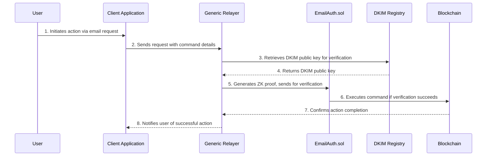

import DocCardList from '@theme/DocCardList';

# Architecture

This system introduces **email-verified actions** on the blockchain, making use of existing email infrastructure, **DKIM (DomainKeys Identified Mail) signatures**, and **zero-knowledge proofs** (ZKPs) to ensure privacy and security. Here’s a high-level breakdown of each component and its function in the system.

## Core Components

To understand the overall architecture, let’s explore each core component and its role in the workflow.

### Components Breakdown

1. **Client Application**: The entry point for users, where they can initiate actions (like account recovery or access control) via email. The client interacts with the relayer’s API to initiate requests.
2. **Generic Relayer**: Acts as the core server that receives email-based requests from the client. It verifies the DKIM signature, generates the ZK proof, and submits the command to the blockchain for execution.
3. **EmailAuth.sol Contract**: Manages email verification on-chain. It authenticates emails based on DKIM and ZK proofs and executes commands defined in the contract templates.
4. **Command Implementation Contract**: Defines specific command logic triggered by authenticated emails. It interacts with `EmailAuth.sol` to verify each command and execute corresponding actions.
5. **DKIM Registry**: Holds public keys for verifying DKIM signatures, allowing the system to confirm the sender’s authenticity.
6. **Blockchain Network**: Hosts the smart contracts, processes transactions, and maintains a tamper-proof record of actions executed through email verification.

## How the System Works

The following sequence provides a streamlined view of how each component interacts to execute an email-based transaction.

### Workflow Diagram

### Step-by-Step Breakdown

1. **Request Initiation**: The **Client Application** allows the user to initiate an email-based transaction (such as account recovery or verification).
2. **Relayer Processing**: The **Generic Relayer** receives the request and retrieves the necessary DKIM public key from the **DKIM Registry**.
3. **Email Verification and Proof Generation**: The relayer generates a zero-knowledge proof to validate the email's content without revealing sensitive data.
4. **On-chain Verification and Execution**: The **EmailAuth.sol contract** verifies the proof using the DKIM public key, authenticating the email. If verified, the command is executed on-chain.
5. **Confirmation and Notification**: Once the command executes, the user receives a confirmation notification.

This process enables trustless and private email-based interactions with the blockchain, removing the need for centralized intermediaries and ensuring that only authenticated users can execute commands.

## Explore Further

To dive deeper into each architectural component, explore the following sub-pages:

<DocCardList 
  items={[
    {
      type: 'link',
      href: '/architecture/dkim-verification',
      label: 'DKIM Verification',
      description: 'How DKIM ensures trustless email verification in the architecture.',
    },
    {
      type: 'link',
      href: '/architecture/zk-proofs',
      label: 'Zero-Knowledge Proofs',
      description: 'Understanding the role of ZKPs in secure email verification.',
    },
    {
      type: 'link',
      href: '/architecture/on-chain',
      label: 'On-chain Integration',
      description: 'Explore how on-chain verification functions in the architecture.',
    },
    {
      type: 'link',
      href: '/architecture/security-considerations',
      label: 'Security Considerations',
      description: 'Learn about the key security features and trust assumptions.',
    }
  ]}
/>
