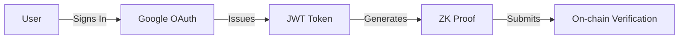

import DocCardList from '@theme/DocCardList';

# Overview

ZK-JWT enables anonymous verification of JWT signatures while masking specific claims. It allows verification of JWTs from specific issuers or domains, as well as verification based on specific claims in the payload, all while maintaining privacy through zero-knowledge proofs. The system consists of three core packages that handle circuit generation, on-chain verification, and helper utilities.

## Authentication Flow

### JWT Generation & Proof Creation

### Verification Process

The verification process maintains privacy while ensuring authenticity:
1. JWT signature is verified through RSA validation
2. Claims are selectively revealed using zero-knowledge proofs
3. Domain verification is handled through anonymous Merkle proofs
4. On-chain verification confirms proof validity without exposing JWT data

## Documentation

<DocCardList 
  items={[
    {
      type: 'link',
      href: 'packages/circuits',
      label: 'Circuits',
      description: 'Zero-knowledge circuits for JWT verification',
    },
    {
      type: 'link',
      href: 'packages/contracts',
      label: 'Contracts',
      description: 'On-chain verification contracts',
    },
    {
      type: 'link',
      href: 'packages/helpers',
      label: 'Helpers',
      description: 'TypeScript utilities for circuit inputs and JWT handling',
    }
  ]}
/>
