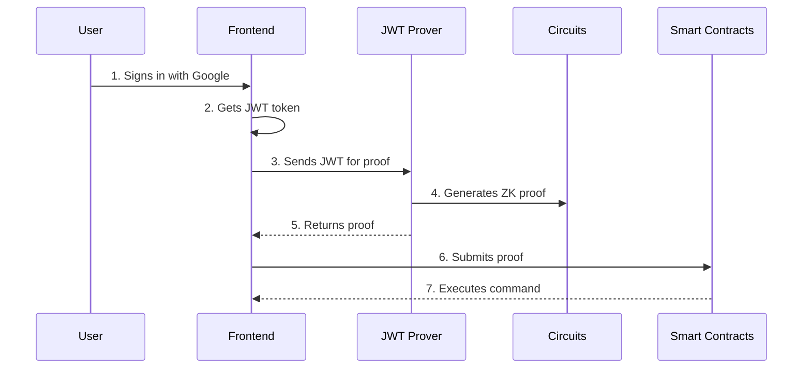

# Architecture

This system enables **JWT-based actions** on the blockchain using Google Sign-In, zero-knowledge proofs (ZKPs), and smart contracts to ensure privacy and security. Here's a detailed breakdown of the architecture.

## Core Components

### Components Breakdown

1. **Frontend Application**: React-based interface where users sign in with Google and initiate actions. Built with Next.js and Chakra UI.
2. **JWT Prover Service**: External service that generates zero-knowledge proofs from JWT tokens.
3. **Circuit System**: Circom circuits that define the verification logic for JWT proofs.
4. **Smart Contracts**: Solidity contracts that verify proofs and execute commands on-chain.

### Key Contracts

1. **JwtVerifier.sol**: Main contract for verifying JWT proofs and executing commands
2. **JwtRegistry.sol**: Stores and manages JWT-related data like DKIM public keys
3. **JwtGroth16Verifier.sol**: Handles the low-level ZK proof verification

## How the System Works

### Workflow Diagram

