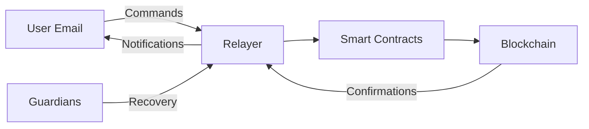

# Web3 UX Enhancement

<div style={{fontSize: '1.2em', marginBottom: '2em'}}>
Making Web3 accessible to everyone by bringing familiar email-based interactions to blockchain. No seed phrases, no complex interfaces - just email.
</div>

## The Vision: Web3 That Feels Like Banking

Traditional Web3 interactions are intimidating for mainstream users:
- 🔐 Complex seed phrases to memorize
- 😰 Fear of losing access forever
- 🤯 Confusing wallet interfaces
- ⚠️ High risk of irreversible mistakes

**Our solution**: Use email as the interface to Web3, making it as simple and secure as online banking.

## Proven Success Stories

### **Accessible Cryptocurrency Operations**
**Traditional Challenge**: Complex wallet interfaces and seed phrase management create barriers for non-technical users  
**Email Wallet Solution**: Natural language transaction commands through familiar email interfaces  
**Technical Implementation**: Email-controlled smart contract accounts with DKIM-based authentication and social recovery mechanisms

### **Enterprise-Grade Account Recovery** 
**Traditional Challenge**: Multi-signature wallet management requires specialized knowledge and training  
**ZK Email Solution**: Guardian-based recovery using familiar email approval workflows with cryptographic security guarantees  
**Technical Implementation**: Time-locked recovery modules using ERC-7579 account abstraction with distributed threshold signatures

### **Simplified DeFi Interactions**
**Traditional Challenge**: DeFi protocols require understanding of complex smart contract interactions  
**Email Transaction System**: Natural language commands automatically translated to smart contract calls  
**Technical Implementation**: Email parsing with intent recognition, automated transaction batching, and confirmation mechanisms

## The Three Pillars of Accessible Web3

### 📧 **Email as Your Wallet**
Control $10M+ in assets through simple email commands:
- Send crypto: "Send 0.5 ETH to alice@company.com"
- DeFi operations: "Withdraw my USDC from Compound"  
- NFT transfers: "Send my Bored Ape to @username on Twitter"
- Multi-chain: Works across Ethereum, Polygon, Arbitrum, and more

### 🛡️ **Cryptographically Secure Recovery**
Enterprise-level security through cryptographic protocols:
- **Threshold Social Recovery**: M-of-N guardian schemes using cryptographic commitments
- **Time-lock Protection**: Configurable delay periods (24-168 hours) to prevent unauthorized access
- **Distributed Trust**: No single point of failure through guardian distribution and on-chain validation
- **Immutable Audit Trail**: All recovery attempts cryptographically logged on-chain with non-repudiation

### 🎯 **Human-Readable Everything**
Complex blockchain operations become simple:
- **Natural language**: "Buy $100 of Bitcoin when it drops below $40k"
- **Email confirmations**: Every transaction sent to your inbox
- **Template system**: Save common operations as one-click actions
- **Error prevention**: Plain English warnings before risky operations

## Our Solutions

### 🏦 Email Wallet

A complete smart contract wallet system controlled via email:

**Key Features:**
- ERC-4337 & ERC-7579 compliant
- Modular architecture for extensions
- Email-based transaction authorization
- Integration with existing wallets

**How it works:**
1. Deploy a smart contract wallet linked to your email
2. Send transaction commands via email
3. Relayer processes and executes on-chain
4. Receive confirmation in your inbox

[Explore Email Wallet →](email-wallet/)

### 🔄 Account Recovery

Secure wallet recovery using email guardians:

**Key Features:**
- Guardian-based social recovery
- Time-locked security delays
- Works with any ERC-7579 wallet
- No centralized control

**Recovery Process:**
1. Lose access to your wallet
2. Contact your email guardians
3. Guardians approve recovery via email
4. Regain access after security delay

[Learn about Account Recovery →](account-recovery/)

### 📝 Email Transaction Builder

Framework for building custom email-based blockchain interactions:

**Key Features:**
- Extensible command system
- Natural language processing
- Multi-chain support
- Custom business logic

**Use Cases:**
- DAO governance via email
- Automated DeFi strategies
- Cross-chain operations
- Custom protocol interactions

[Build with Transaction Builder →](email-tx-builder/)

## Real-World Impact

### For End Users
- ✅ Use Web3 without technical knowledge
- ✅ Never worry about losing access
- ✅ Familiar email interface
- ✅ Bank-like security guarantees

### For Developers
- ✅ Onboard non-crypto users easily
- ✅ Reduce support burden
- ✅ Build accessible dApps
- ✅ Focus on features, not UX complexity

### For Enterprises
- ✅ Deploy blockchain solutions to existing users
- ✅ Compliance-friendly recovery mechanisms
- ✅ Audit trails via email
- ✅ Reduced training requirements

## Architecture Overview



## Quick Start

<div className="row">
  <div className="col col--4">
    <div className="card">
      <div className="card__header">
        <h3>Try Email Wallet</h3>
      </div>
      <div className="card__body">
        <p>Deploy your first email-controlled wallet:</p>
        <ol>
          <li>Install dependencies</li>
          <li>Configure email settings</li>
          <li>Deploy wallet contract</li>
          <li>Send your first email transaction</li>
        </ol>
      </div>
      <div className="card__footer">
        <a href="email-wallet/" className="button button--primary button--block">Get Started</a>
      </div>
    </div>
  </div>
  <div className="col col--4">
    <div className="card">
      <div className="card__header">
        <h3>Setup Recovery</h3>
      </div>
      <div className="card__body">
        <p>Add guardians to your wallet:</p>
        <ol>
          <li>Choose trusted guardians</li>
          <li>Configure recovery delays</li>
          <li>Test recovery flow</li>
          <li>Document procedures</li>
        </ol>
      </div>
      <div className="card__footer">
        <a href="account-recovery/setup" className="button button--primary button--block">Setup Guide</a>
      </div>
    </div>
  </div>
  <div className="col col--4">
    <div className="card">
      <div className="card__header">
        <h3>Build Custom Commands</h3>
      </div>
      <div className="card__body">
        <p>Create email-based interactions:</p>
        <ol>
          <li>Define command templates</li>
          <li>Implement handlers</li>
          <li>Deploy contracts</li>
          <li>Test with emails</li>
        </ol>
      </div>
      <div className="card__footer">
        <a href="email-tx-builder/quickstart" className="button button--primary button--block">Build Now</a>
      </div>
    </div>
  </div>
</div>

## Example: Send ETH via Email

```text
To: wallet@yourdomain.com
Subject: Send 0.5 ETH to alice.eth

Please send 0.5 ETH to alice.eth for the conference ticket.
```

The system will:
1. Verify your email signature
2. Parse the command
3. Execute the transaction
4. Send confirmation email

## Infrastructure Components

### Relayer
- Processes email commands
- Executes blockchain transactions
- Manages email notifications
- Handles recovery requests

### Smart Contracts
- ERC-7579 modular accounts
- Recovery modules
- Transaction validation
- Access control

### Supporting Services
- Email parsing and validation
- DKIM verification
- Transaction queue management
- Guardian coordination

## Security Model & Considerations

### **Cryptographic Foundations**
- **DKIM Authentication**: RSA signature verification prevents email spoofing with computational security guarantees
- **Zero-Knowledge Proofs**: Email contents remain private while proving authorization validity
- **Smart Contract Validation**: All operations verified on-chain with mathematical guarantees

### **Threat Model & Mitigations**
- **Compromised Email**: Time-locked delays (24-168h) provide window for legitimate user intervention
- **Guardian Collusion**: Threshold schemes (M-of-N) prevent single guardian attacks
- **Key Rotation**: Support for DKIM key rotation with historical key validation
- **Replay Attacks**: Nonce-based transaction ordering prevents duplicate operations

### **Trust Assumptions**
- **Email Infrastructure**: Assumes honest DKIM implementation by email providers
- **Smart Contract Security**: Relies on audited smart contract implementations
- **Guardian Honesty**: Recovery security depends on guardian integrity and distribution
- **Cryptographic Primitives**: Security under standard cryptographic assumptions (RSA, ECDSA, discrete log)

## Get Involved

- 💬 Join our [Telegram](https://t.me/zkemail) community
- 🌟 Star our [GitHub repos](https://github.com/zkemail)
- 🚀 Try our [live demo](https://emailwallet.org)
- 📖 Read our [security audits](audits)

:::tip
Start with Email Wallet to experience the simplicity, then explore Account Recovery to add security for your users.
:::